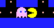
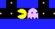

= 6 Pinky

Pinky, le rose, est notre candidat suivant. Il devra se comporter comme Clyde jusqu'à ce que, à une intersection, il aperçoive Pacman. Il le prendra alors en chasse jusqu'à ce qu'il le perde de vue.

Nous allons modifier la fonction `+ghostMove+` pour gérer le comportement d'un second fantôme. Si tout votre code est encore dans un seul fichier, créez en une nouvelle paire qui regroupera les déplacements des fantômes.

Maintenant que nous avons un second fantôme, il va falloir le différencier du premier. Pour cela, créez un enum qui contiendra leur nom.

----
typedef enum GhostName GhostName;
enum GhostName
{
    BLINKY,
    CLYDE,
    INKY,
    PINKY
};
----

Ajoutez une variable `+GhostName+` dans la structure `+Ghost+`.

On en profitera pour ajouter la texture du fantôme. Votre structure devrait ressembler à cela :

----
struct Ghost
{
    Coord pos;
    Coord dir;
    GhostName name;
    SDL_Texture * texture;
};
----

Si on veut que Pinky suive Pacman, il faut donner en paramètre à la fonction `+ghostMove+` le coordonnées de Pacman.

Créez une fonction `+specificGhostMovment+` qui appellera une fonction spécifique pour chaque fantôme en fonction de son nom. Vous appellerez cette fonction dans le cas d'une intersection.

Déplacez le code de Clyde dans `+clydeMove+` puis créez une fonction `+pinkyMove+`.

Vous commencerez par vérifier s'il y a une ligne de vue directe entre Pinky et Pacman, c'est-à-dire qu'ils sont sur la même ligne ou colonne et qu'il n'y a pas de mur entre eux. Si ce n'est pas le cas, appelez la fonction de clyde.

=== Colisions

Maintenant que nous avons deux fantômes en jeu, il faut s'intéresser aux collisions. +
Créez une fonction qui vérifie la collision entre pacman et un fantôme.

Faites attention à ce cas : pacman et un fantôme avancent l'un vers l'autre, puis ils se croisent sans jamais être sur la même case.

[.float-group]
--
 [6.1, role=left]
 [6.2, role=left]
--

Vous devrez vérifier s'ils ont inversé leur place, la direction vous aidera.
Rappelez-vous, si `+x + dirX+` vous donne la prochaine case, `+x - dirX+` vous donne la précédente.

Vous devez maintenant passer cinq paramètres à la fonction collision, donc quatre qui concernent Pacman.
A bien y réfléchir, quelle est la différence entre Pacman et un fantôme ?

Remplacez `+Ghost+` par `+MovingEntity+`, et `+GhostName+` par `+EntityName+`, puis modifiez votre code pour utiliser ces nouvelles structures.