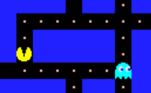
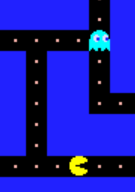
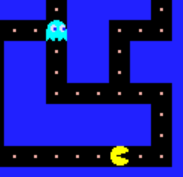

= 7 Inky

Inky va suivre Pacman de manière assez simple : à chaque intersection, il prendra la direction de Pacman.

Dans la fonction `+inkyMove+`, à une intersection, Inky essaiera de prendre la direction qui lui permet de réduire la plus grande différence de position avec Pacman (horizontale ou verticale). Si ce n'est pas possible, il essaiera de réduire l'autre. S'il ne peut prendre aucune direction intéressante, il prendra n'importe laquelle.

N'oubliez-pas qu'un fantôme ne fait jamais demi-tour.

[.float-group]
--
 [7.1, role=left]

Si Inky montait, il ira à gauche. +
La distance horizontale qui le sépare de Pacman est plus grande que la distance verticale.
--

[.float-group]
--
 [7.2, role=left]

Si Inky descendait, il ira en bas. +
 +

Si Inky montait, il ira à gauche.
--

[.float-group]
--
 [7.3, role=left]

Si Inky montait, il ira à gauche ou en haut (car aucune des deux directions ne le rapproche de Pacman).
--

Une fois que Inky saura parfaitement suivre Pacman, vous vous rendrez compte que lui échapper devient très difficile. Nous allons donc le rendre moins bon, pour qu'il soit plaisant de jouer contre lui. +
Introduisez une constante `+#define INKY_RANDOMNESS 3+`, puis ajoutez au début de la fonction `+inkyMove+` une condition d'une chance sur `+INKY_RANDOMNESS+` que Inky prenne une direction aléatoire. Testez plusieurs valeurs pour établir celle qui rend le jeu intéressant.